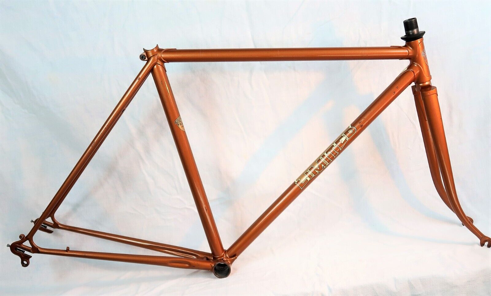

## The Quality Steel Bicycle Frame ##

If you're not familiar with steel-framed bicycles, don't worry, you're not alone. While you might have ridden one as a kid, it's likely you've since switched to the lighter and more modern materials of aluminium or carbon fiber. But if you're looking to get back to basics and explore the world of steel frames, this article is for you. In it, we'll help you identify the key characteristics of a high-quality adult-sized steel frame, so you can make an informed decision when it comes to your next ride.
